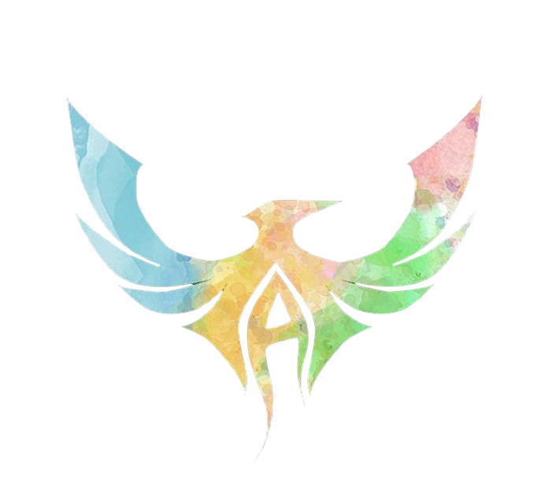

# ANIMA - The Aero Club of NIT Agartala

<div align="center">
  
  <h3>"Design, build, soar—our passion takes flight in every creation"</h3>
</div>

## 🚀 About

Welcome to the official website of ANIMA, the Aero Modeling Club of NIT Agartala. Established in 2017, our club brings together aviation enthusiasts to explore the exciting world of miniature flight. This website showcases our projects, team, and resources.

## ✨ Features

- **Responsive Design**: Fully responsive website that works on all devices
- **Modern UI**: Clean and intuitive user interface
- **Fast Performance**: Built with React and Vite for optimal performance
- **Interactive Elements**: Smooth animations and transitions

## 🛠️ Technologies Used

- **React**: A JavaScript library for building user interfaces
- **Vite**: Next generation frontend tooling
- **React Router**: For seamless navigation between pages
- **CSS3**: For styling and animations
- **Font Awesome**: For icons

## 📋 Pages

- **Home**: Introduction to ANIMA with about section and achievements
- **Projects**: Showcase of our various aero modeling projects
- **Team**: Meet our dedicated team members
- **Resources**: Helpful resources for aero modeling enthusiasts

## 🚀 Getting Started

### Prerequisites

- Node.js (v14.0.0 or later)
- npm (v6.0.0 or later)

### Installation

1. Clone the repository
   ```bash
   git clone https://github.com/Parship999/ANIMA.git
   ```

2. Navigate to the project directory
   ```bash
   cd ANIMA
   ```

3. Install dependencies
   ```bash
   npm install
   ```

4. Start the development server
   ```bash
   npm run dev
   ```

5. Open your browser and visit `http://localhost:5173`

## 🌐 Deployment

To build the project for production:

```bash
npm run build
```

The build files will be located in the `dist` directory.

## 📞 Contact

For any inquiries, please reach out to us through:

- [Instagram](https://www.instagram.com/anima_the_aero_club/)
- [LinkedIn](https://www.linkedin.com/company/anima-the-aero-club-of-nit-agartala/)

## 📝 License

This project is licensed under the MIT License - see the LICENSE file for details.

---

<div align="center">
  <p>Designed with ❤️ by Parship</p>
</div>
